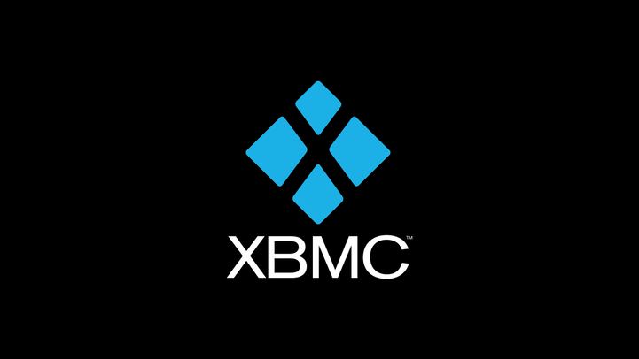

  

## XBMC
This is port of XBMC4Xbox 4.0+ and Kodi v20 Nexus to Original Xbox using open source toolchain known as [NXDK (New Xbox Development Kit)](https://github.com/XboxDev/nxdk). It's currently in pre-alpha stage and can only be compiled. I will need help from other devs to get it working, so contributions are welcome!

## Current status
Currently around 80% of source code is based on Kodi Nexus while other 20% is mix between XBMC4Xbox and Kodi Krypton. GUILIB, basic dialogs (YES/NO, OK, KaiToast etc.), CButtonTranslator and CApplication are based on Kodi Krypton and XBMC4Xbox. Everything else is Kodi Nexus. For more detailes, please check our [roadmap](docs/roadmap/README.md).
